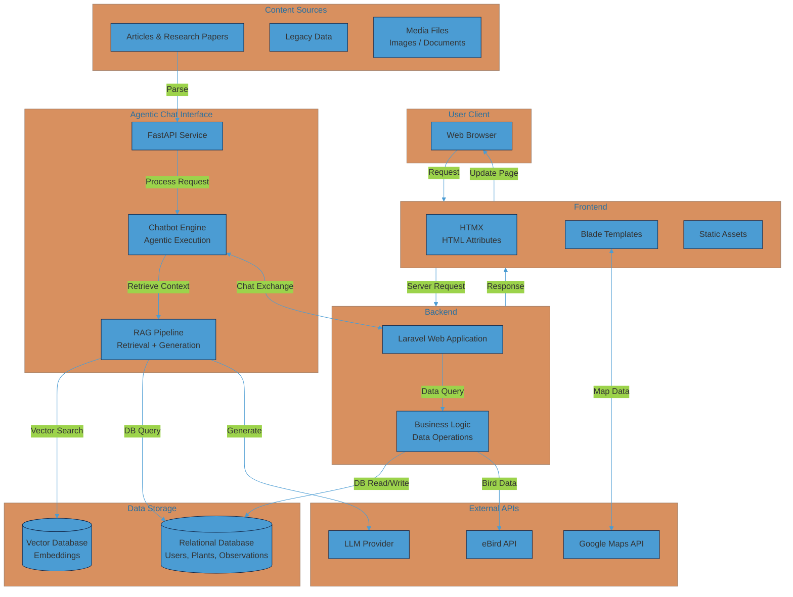

## Application Architecture

```mermaid
%%{init: {
  "theme": "base",
  "themeVariables": {
    "primaryColor": "#4B9CD3",
    "primaryBorderColor": "#13294B",
    "primaryTextColor": "var(--text-color)",

    "secondaryColor": "var(--background)",
    "secondaryBorderColor": "#4B9CD3",
    "secondaryTextColor": "var(--text-color)",

    "lineColor": "#4B9CD3",
    "textColor": "var(--text-color)"
  }
}}%%

graph TB

subgraph UserClient["User Client"]
    Browser["Web Browser"]
end

subgraph Frontend["Frontend"]
    HTMX["HTMX<br/>HTML Attributes"]
    Templates["Blade Templates"]
    Static["Static Assets"]
end

subgraph Backend["Backend"]
    WebApp["Laravel Web Application"]
    BusinessLogic["Business Logic<br/>Data Operations"]
end

subgraph ChatBot["Agentic Chat Interface"]
    AIAPI["FastAPI Service"]
    Chatbot["Chatbot Engine<br/>Agentic Execution"]
    RAG["RAG Pipeline<br/>Retrieval + Generation"]
end

subgraph DataStorage["Data Storage"]
    RelationalDB[("Relational Database<br/>Users, Plants, Observations")]
    VectorDB[("Vector Database<br/>Embeddings")]
end

subgraph ContentSources["Content Sources"]
    Documents["Articles & Research Papers"]
    LegacyData["Legacy Data"]
    Images["Media Files<br/>Images / Documents"]
end

subgraph ExternalAPIs["External APIs"]
    LLM["LLM Provider"]
    Maps["Google Maps API"]
    EBird["eBird API"]
end

Browser -->|Request| Frontend
Frontend -->|Server Request| Backend
Backend -->|Response| Frontend
Frontend -->|Update Page| Browser


WebApp -->|Data Query| BusinessLogic
BusinessLogic -->|DB Read/Write| RelationalDB


AIAPI -->|Process Request| Chatbot
Chatbot -->|Retrieve Context| RAG
RAG -->|Vector Search| VectorDB
RAG -->|DB Query| RelationalDB
RAG -->|Generate| LLM
Chatbot <-- "Chat Exchange" --> WebApp


Documents -->|Parse| AIAPI


BusinessLogic -->|Bird Data| EBird
Templates <-->|Map Data| Maps


classDef accent fill:#4B9CD3,color:#FFFFFF,stroke:#13294B;

class Browser neutral;
class HTMX,Templates,Static neutral;
class WebApp,BusinessLogic neutral;
class AIAPI,Chatbot,RAG neutral;
class RelationalDB,VectorDB neutral;
class Documents,LegacyData,Images neutral;
class LLM,Maps,EBird neutral;

```

> See our [[deliverables/platform-select|Platform Selection]] page for the motivations on our platform choices.