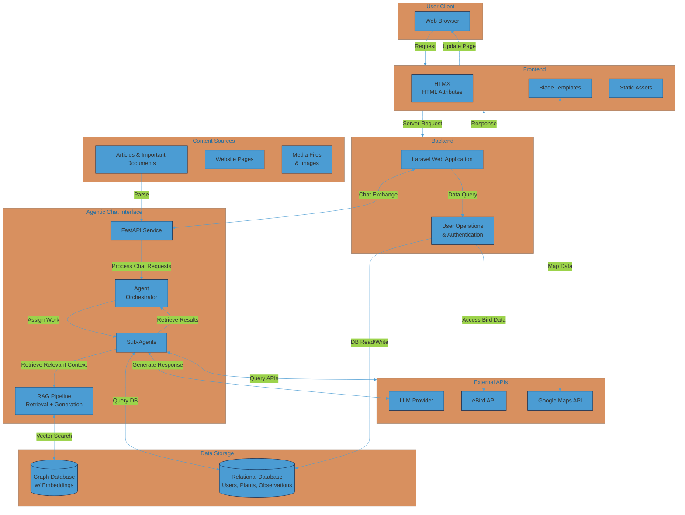

## Application Architecture

```mermaid
%%{init: {
  "theme": "base",
  "themeVariables": {
    "primaryColor": "#4B9CD3",
    "primaryBorderColor": "#13294B",
    "primaryTextColor": "var(--text-color)",

    "secondaryColor": "var(--background)",
    "secondaryBorderColor": "#4B9CD3",
    "secondaryTextColor": "var(--text-color)",

    "lineColor": "#4B9CD3",
    "textColor": "var(--text-color)"
  }
}}%%

graph TB

  

subgraph UserClient["User Client"]

Browser["Web Browser"]

end

  

subgraph Frontend["Frontend"]

HTMX["HTMX<br/>HTML Attributes"]

Templates["Blade Templates"]

Static["Static Assets"]

end

  

subgraph Backend["Backend"]

WebApp["Laravel Web Application"]

StandardLogic["User Operations<br/>& Authentication"]

end

  

subgraph ChatBot["Agentic Chat Interface"]

AIAPI["FastAPI Service"]

AgentOrchestrator["Agent<br/>Orchestrator"]

AgentFleet["Sub-Agents"]

RAG["RAG Pipeline<br/>Retrieval + Generation"]

end

  

subgraph DataStorage["Data Storage"]

RelationalDB[("Relational Database<br/>Users, Plants, Observations")]

VectorDB[("Graph Database<br/>w/ Embeddings")]

end

  

subgraph ContentSources["Content Sources"]

Documents["Articles & Important Documents"]

WebsiteContent["Website Pages"]

Images["Media Files<br/>& Images"]

end

  

subgraph ExternalAPIs["External APIs"]

LLM["LLM Provider"]

Maps["Google Maps API"]

EBird["eBird API"]

end

  

Browser -->|Request| Frontend

Frontend -->|Server Request| Backend

Backend -->|Response| Frontend

Frontend -->|Update Page| Browser

  
  

WebApp <-- "Chat Exchange" --> AIAPI

WebApp -->|Data Query| StandardLogic

StandardLogic -->|DB Read/Write| RelationalDB

  
  

AIAPI -->|Process Chat Requests| AgentOrchestrator

AgentFleet -->|Retrieve Relevant Context| RAG

AgentFleet -->|Retrieve Results| AgentOrchestrator

AgentOrchestrator-->|Assign Work|AgentFleet

RAG <-->|Vector Search| VectorDB

AgentFleet <-->|Query DB| RelationalDB

AgentFleet <-->|Generate Response| LLM

AgentFleet <-->|Query APIs| ExternalAPIs

  
  
  

Documents -->|Parse| AIAPI

  
  

StandardLogic -->|Access Bird Data| EBird

Templates <-->|Map Data| Maps

  
  

classDef accent fill:#4B9CD3,color:#FFFFFF,stroke:#13294B;

  

class Browser neutral;

class HTMX,Templates,Static neutral;

class WebApp,StandardLogic neutral;

class AIAPI,AgentOrchestrator,RAG neutral;

class RelationalDB,VectorDB neutral;

class Documents,WebsiteContent,Images neutral;

class LLM,Maps,EBird neutral;
```
